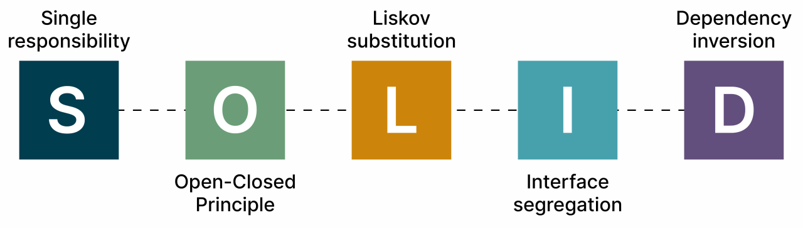
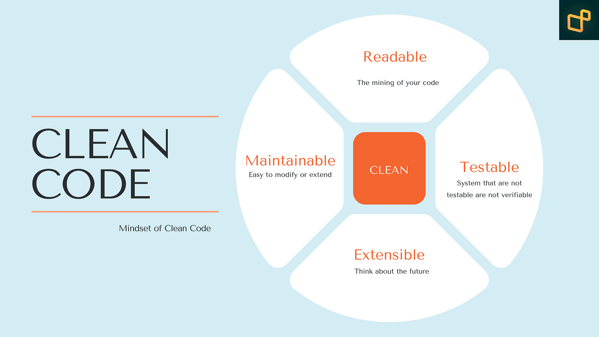

# Flutter Project Architecture


This Flutter project is organized following the **SOLID principles** and the **MVVM architecture**, ensuring a **modular, scalable, and maintainable structure**. This README aims to provide a detailed overview of the project's architecture and organization.

## SOLID Principles



The acronym SOLID represents the five principles that facilitate the development process, making software maintenance and expansion easier. These principles are fundamental in object-oriented programming and can be applied in any language that adopts this paradigm.

1. **S - Single Responsibility Principle**: Each class should have only one reason to change. If a class has multiple responsibilities, changing one project requirement can bring multiple reasons to modify the class. Classes should have single responsibilities. This principle can be extended to methods as well. The more tasks a method performs, the harder it is to test and ensure that the program is in order.

2. **O - Open/Closed Principle**: Software entities (such as classes and methods) should be open for extension but closed for modification. If a class is open for modification, the more features we add, the more complex it will become. It is ideal to adapt the code to extend it, not to alter it.

3. **L - Liskov Substitution Principle**: Derived classes (or subclasses) should be able to replace their base classes (or parent classes) without altering the functionality of the program. A subclass should be able to perform everything that its parent class does. This principle reinforces polymorphism and the correct use of inheritance.

4. **I - Interface Segregation Principle**: A class should not be forced to implement interfaces and methods that it does not use. We should create specific interfaces instead of having a single generic interface.

5. **D - Dependency Inversion Principle**: Depend on abstractions, not on concrete implementations. High-level modules should not depend directly on the implementation details of low-level modules. They should depend on abstractions or interfaces that define operational contracts.

## Clean Code



Writing clean code means writing code in a way that is easy to understand without complications. This not only simplifies code manipulation but also facilitates team collaboration. All development and maintenance of the system become easier.

- **Use meaningful names**: Descriptive names help understand the purpose of a part of the code without needing explanatory comments.
- **Prioritize small functions**: Writing small methods or functions focused on a single task is essential to keep the code clear and follow the single responsibility principle (SRP).
- **Avoid unnecessary comments**: Code should be self-explanatory, with meaningful names and clear logical structure. Excessive comments can make the code cluttered and difficult to maintain.
- **Avoid complexity**: Unnecessary complexity can increase the likelihood of errors and make the code difficult to maintain.
- **Minimize the number of parameters**: Functions and methods should have as few parameters as possible. This improves readability and ease of use.
- **Avoid repetitive code**: Repetition makes the code difficult to maintain, as necessary changes need to be applied in multiple places. Extract repeated code into functions or methods to promote reuse and efficient maintenance.

## MVVM Architecture


Model-View-ViewModel (MVVM) is an architectural pattern that separates presentation logic from business and data logic.

- **Model**: Represents the application's data and business logic. It encapsulates data objects, data access methods, and validation rules.
- **View**: Responsible for displaying the user interface to the user. It is usually implemented using widgets. Widgets are declarative and describe how the user interface should look based on the current state. The View should be as simple as possible, focusing only on rendering the user interface and user interactions, with minimal function calls.
- **ViewModel**: Acts as an intermediary between the View and the Model. It exposes the necessary data and commands to the View and provides methods to handle user interactions. The ViewModel also maintains the View's state and notifies the View of any data changes. The ViewModel can be implemented using the ‘provider’ or 'bloc' package, which provides a direct way to manage state.

## Repository Structure


The repository is divided into three main projects:

1. **Core**: Contains the core logic and business rules.
2. **Mobile**: Contains the presentation layer for Android and iOS.
3. **Web**: Contains the presentation layer for the web.

## 3-Layer Architecture


### 1. Data

This layer is responsible for data manipulation, including communication with remote or local data sources.

- **Datasources**: Defines interfaces and implementations for data access. They can be local (such as an SQLite database) or remote (like Firebase or a REST API).
- **Models**: Classes that represent data and have toJson and fromJson methods for serialization and deserialization.
- **Repositories**: Repository implementations that use datasources to perform data reading and writing operations. Repositories act as an intermediate layer between datasources and the domain layer.

### 2. Domain

Contains business logic and application rules.

- **Entities**: Definitions of domain entities, usually simple with constructors and parameters. They represent fundamental business objects.
- **Repositories**: Repository interfaces, defining the contracts for data operations. These interfaces are implemented in the data layer.
- **Usecases**: Use cases that encapsulate business logic. Each repository function has a corresponding use case, which is responsible for orchestrating the execution of domain operations.

### 3. Presentation

Responsible for the user interface and user interaction of each project (mobile or web).

- **View**: Contains pages and widgets. Represents the graphical user interface and is responsible for data rendering.
- **ViewModel**: Contains controllers responsible for managing the application's temporary states and performing small interface logic operations, and providers responsible for managing state and presentation logic. They receive data from the Model/Core and update the View as needed.

## Commands to Create Projects

### Core

Create a new package:

```bash
flutter create --template=package core
```

Add the dependencies in the pubspec.yaml according to the core project's needs:

```yaml
name: core
description: Core logic and business rules for the project.
publish_to: "none" # If you dont want to publish

dependencies:
  fpdart: ^1.1.0 # To use functional programming
```

### Mobile

Create a new Flutter project:

```bash
flutter create -t app --platforms=android,ios mobile
```

Add the dependencies in the pubspec.yaml according to the mobile project's needs.

```yaml
name: mobile
description: "Mobile-specific code for the project."
publish_to: "none" # If you dont want to publish

dependencies:
  flutter:
    sdk: flutter
  core:
    path: ../core
```

### Web

Create a new Flutter web project:

```bash
flutter create -t app --platforms=web web
```

Add the dependencies in the pubspec.yaml according to the web project's needs.

```yaml
name: web
description: "Web-specific code for the project."
publish_to: "none" # If you dont want to publish

dependencies:
  flutter:
    sdk: flutter
  core:
    path: ../core
```

## Unit Tests

Unit tests are essential to ensure code quality and correctness. They allow verifying if each part of the code works as expected in isolation. In this project, I organized the tests following the same folder structure and architecture.

### Unit Test Example for a Usecase

**Test for the GetMedia Usecase**:

```dart
// Mock classes
class MockMediaRepository extends Mock implements MediaRepository {}

void main() {
  late GetMedia useCase;
  late MockMediaRepository mockRepository;

  setUp(() {
    mockRepository = MockMediaRepository();
    useCase = GetMedia(mockRepository);
  });

  final mediaList = [
    Media(
      url: 'url',
      title: 'Test Media',
      explanation: 'Test Media explanation',
      date: DateTime.now(),
      mediaType: MediaType.image,
    ),
  ];

  test('should get media from the repository', () async {
    // Arrange
    when(mockRepository.getMedia(date: anyNamed('date')))
        .thenAnswer((_) async => right(mediaList));

    // Act
    final result = await useCase(const NoParams());

    // Assert
    expect(result, right(mediaList));
    verify(mockRepository.getMedia(date: anyNamed('date')));
    verifyNoMoreInteractions(mockRepository);
  });
}
```

## Variable and File Naming

To maintain consistency and facilitate file identification, we follow a specific naming convention. If we are working on an authentication feature or service, the files always start or contain the word "auth". This makes it easier to search and organize files in the project.
