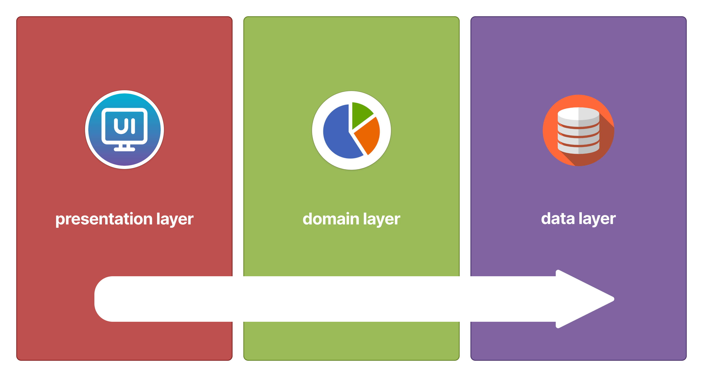

# Flutter Project Architecture


Este projeto Flutter é organizado seguindo os **princípios SOLID** e a **arquitetura MVVM**, garantindo uma **estrutura modular, escalável e de fácil manutenção**. Este README tem como objetivo fornecer uma visão detalhada da arquitetura e da organização do projeto.

## Princípios SOLID


O acrônimo SOLID representa os cinco princípios que facilitam o processo de desenvolvimento, o que facilita a manutenção e a expansão do software. Estes princípios são fundamentais na programação orientada a objetos e podem ser aplicados em qualquer linguagem que adote este paradigma.

1. **S - Single Responsibility Principle (Princípio da Responsabilidade Única)**: Cada classe deve ter um, e somente um, motivo para mudar. Se uma classe tem várias responsabilidades, mudar um requisito do projeto pode trazer várias razões para modificar a classe. As classes devem ter responsabilidades únicas. Este princípio pode ser estendido para os métodos. Quanto mais tarefas um método executa, mais difícil é testá-lo e garantir que o programa está em ordem.

2. **O - Open/Closed Principle (Princípio Aberto/Fechado)**: Entidades de software (como classes e métodos) devem estar abertas para extensão, mas fechadas para modificação. Se uma classe está aberta para modificação, quanto mais recursos adicionarmos, mais complexa ela vai ficar. O ideal é adaptar o código para estendê-la, não para alterá-la.

3. **L - Liskov Substitution Principle (Princípio da Substituição de Liskov)**: Classes derivadas (ou classes-filhas) devem ser capazes de substituir suas classes-base (ou classes-mães) sem alterar o funcionamento do programa. Uma classe-filha deve ser capaz de executar tudo que sua classe-mãe faz. Este princípio reforça o polimorfismo e a correta utilização da herança.

4. **I - Interface Segregation Principle (Princípio da Segregação da Interface)**: Uma classe não deve ser forçada a implementar interfaces e métodos que não serão utilizados. Devemos criar interfaces específicas ao invés de termos uma única interface genérica.

5. **D - Dependency Inversion Principle (Princípio da Inversão da Dependência)**: Dependa de abstrações e não de implementações concretas. Os módulos de alto nível não devem depender diretamente dos detalhes de implementação de módulos de baixo nível. Eles devem depender de abstrações ou interfaces que definem contratos de funcionamento.

## Clean Code


Escrever um código limpo significa escrever códigos de um jeito que conseguimos entendê-lo sem complicação. Isso não apenas simplifica a manipulação do código, mas também facilita a colaboração entre o time. Todo desenvolvimento e manutenção do sistema se torna mais fácil.

- **Possuir nomes significativos**: Nomes descritivos ajudam a entender a finalidade de uma parte do código sem a necessidade de comentários explicativos.
- **Priorizar o uso de funções pequenas**: Escrever métodos ou funções pequenas e focadas em uma única tarefa é fundamental para manter o código claro e seguir o princípio da responsabilidade única (SRP).
- **Evitar comentários desnecessários**: O código deve ser autoexplicativo, com nomes significativos e estrutura lógica clara. Comentários excessivos podem tornar o código poluído e difícil de manter.
- **Evitar complexidade**: A complexidade desnecessária pode aumentar a chance de erros e tornar o código difícil de manter.
- **Passar o mínimo de parâmetros**: Funções e métodos devem ter o mínimo possível de parâmetros. Isso melhora a legibilidade e a facilidade de uso.
- **Evitar código com repetição**: A repetição torna o código difícil de manter, pois quando há mudanças necessárias elas precisam ser aplicadas em múltiplos lugares. Extraia código repetido em funções ou métodos para promover a reutilização e a manutenção eficiente.

## Arquitetura MVVM


Model-View-ViewModel (MVVM) é um padrão de arquitetura que separa a lógica de apresentação da lógica de negócios e de dados.

- **Model**: Representa os dados e a lógica de negócios do aplicativo. Ele encapsula objetos de dados, métodos de acesso a dados e regras de validação.
- **View**: Responsável por exibir a interface do usuário para o usuário. É normalmente implementado usando widgets. Os widgets são declarativos e descrevem como a interface do usuário deve parecer com base no estado atual. A View deve ser a mais simples possível, concentrando-se apenas na renderização da interface do usuário e nas interações do usuário, com poucas chamadas de funções.
- **ViewModel**: Atua como um intermediário entre a View e o Model. Ele expõe os dados e comandos necessários para a View e fornece métodos para lidar com interações do usuário. O ViewModel também mantém o estado da View e notifica a View de quaisquer alterações nos dados. O ViewModel pode ser implementado usando o pacote ‘provider’ ou 'bloc', que oferece uma maneira direta de gerenciar o estado.

## Estrutura do Repositório


O repositório é dividido em três projetos principais:

1. **Core**: Contém a lógica central e regras de negócio.
2. **Mobile**: Contém a camada de apresentação para Android e iOS.
3. **Web**: Contém a camada de apresentação para a web.

## Arquitetura em 3 Camadas



### 1.Data

Esta camada é responsável pela manipulação de dados, incluindo a comunicação com fontes de dados remotas ou locais.

- **Datasources**: Define interfaces e implementações para acesso a dados. Podem ser locais (como um banco de dados SQLite) ou remotas (como o Firebase ou uma API REST).
- **Models**: Classes que representam os dados e possuem métodos toJson e fromJson para serialização e desserialização.
- **Repositories**: Implementações dos repositórios que utilizam os datasources para realizar operações de leitura e escrita de dados. Os repositórios atuam como uma camada intermediária entre os datasources e a camada de domínio.

### 2. Domain

Contém a lógica de negócio e as regras de aplicação.

- **Entities**: Definições das entidades do domínio, geralmente simples com construtores e parâmetros. Elas representam os objetos de negócio fundamentais.
- **Repositories**: Interfaces dos repositórios, definindo os contratos das operações de dados. Estas interfaces são implementadas na camada de data.
- **Usecases**: Casos de uso que encapsulam a lógica de negócios. Cada função do repositório possui um usecase correspondente, que é responsável por orquestrar a execução das operações de domínio.

### 3. Presentation

Responsável pela interface do usuário e pela interação com o usuário de cada projeto(mobile ou web).

- **View**: Contém páginas e widgets. Representa a interface gráfica do usuário e é responsável pela renderização dos dados.
- **ViewModel**: Contém os controladores, responsáveis por gerenciar os estados temporários da aplicação e realizar pequenas operações de lógica de interface, e providers, responsáveis por gerenciar o estado e a lógica de apresentação. Eles recebem dados do Model/Core e atualizam a View conforme necessário.

## Comandos para Criar os Projetos

### Core

Crie um novo pacote:

```bash
flutter create --template=package core
```

Adicione as dependências no pubspec.yaml de acordo com a necessidade do projeto core:

```yaml
name: core
description: Core logic and business rules for the project.
publish_to: "none" # Se você não quiser publicar

dependencies:
  fpdart: ^1.1.0 # Para usar programação funcional
```

### Mobile

Crie um novo projeto Flutter:

```bash
flutter create -t app --platforms=android,ios mobile
```

Adicione as dependências no pubspec.yaml de acordo com a necessidade do projeto mobile.

```yaml
name: mobile
description: "Mobile-specific code for the project."
publish_to: "none" # Se você não quiser publicar

dependencies:
  flutter:
    sdk: flutter
  core:
    path: ../core
```

### Web

Crie um novo projeto Flutter web:

```bash
flutter create -t app --platforms=web web
```

Adicione as dependências no pubspec.yaml de acordo com a necessidade do projeto web.

```yaml
name: web
description: "Web-specific code for the project."
publish_to: "none" # Se você não quiser publicar

dependencies:
  flutter:
    sdk: flutter
  core:
    path: ../core
```

## Testes Unitários

Os testes unitários são essenciais para garantir a qualidade do código e a correção das funcionalidades. Eles permitem verificar se cada parte do código funciona como esperado de forma isolada. Nesse projeto, organizei os testes seguindo a mesma estrutura de pastas e arquitetura.

### Exemplo de Teste Unitário para um Usecase

**Teste para o Usecase GetMedia**:

```dart
// Mock classes
class MockMediaRepository extends Mock implements MediaRepository {}

void main() {
  late GetMedia useCase;
  late MockMediaRepository mockRepository;

  setUp(() {
    mockRepository = MockMediaRepository();
    useCase = GetMedia(mockRepository);
  });

  final mediaList = [
    Media(
      url: 'url',
      title: 'Test Media',
      explanation: 'Test Media explanation',
      date: DateTime.now(),
      mediaType: MediaType.image,
    ),
  ];

  test('should get media from the repository', () async {
    // Arrange
    when(mockRepository.getMedia(date: anyNamed('date')))
        .thenAnswer((_) async => right(mediaList));

    // Act
    final result = await useCase(const NoParams());

    // Assert
    expect(result, right(mediaList));
    verify(mockRepository.getMedia(date: anyNamed('date')));
    verifyNoMoreInteractions(mockRepository);
  });
}
```

## Nomenclatura de Variáveis e Arquivos

Para manter a consistência e facilitar a identificação dos arquivos, seguimos uma convenção de nomenclatura específica. Se estamos trabalhando na feature de autenticação ou no serviço de autenticação, os arquivos sempre começam ou contêm a palavra "auth". Isso facilita a busca e a organização dos arquivos no projeto.
